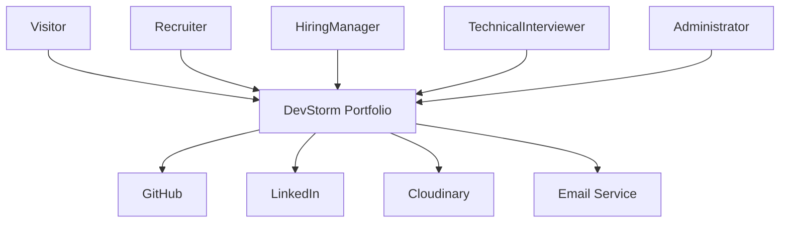
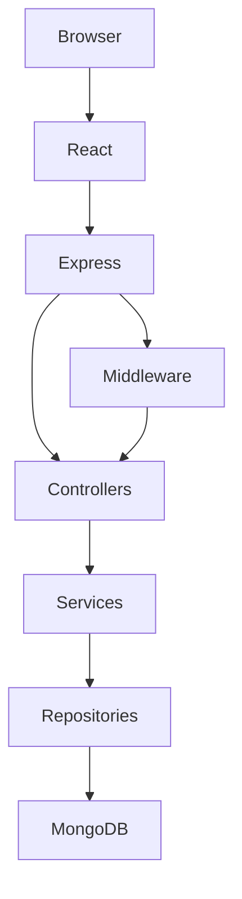
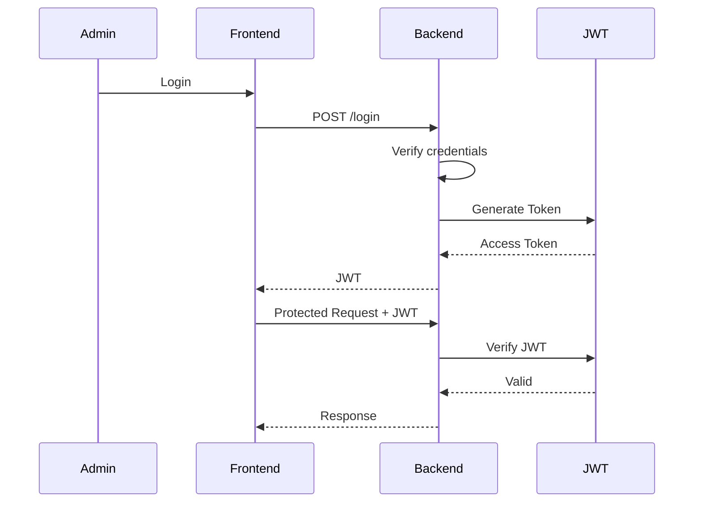

# Module 0.6 - System Architecture

| Document Information | Value |
|----------------------|-------|
| Module | 0.6 |
| Document ID | DSP-SAD-006 |
| Document Name | System Architecture |
| Project | DevStorm Portfolio Platform |
| Version | 0.1 (Draft) |
| Status | In Progress |
| Author | Kaushik Musale |
| Repository | DevStorm Portfolio Platform |
| Last Updated | July 2026 |

---

# Revision History

| Version | Date | Description | Author |
|----------|------|-------------|--------|
| 0.1 | July 2026 | Initial architecture document | Kaushik Musale |

---

# Table of Contents

1. Purpose
2. Scope
3. Architectural Objectives
4. Architectural Style
5. Architecture Principles
6. Quality Attributes
7. Technology Alignment
8. Decision Register

---

# 1. Purpose

The purpose of this document is to define the overall architecture of the DevStorm Portfolio Platform.

This document provides a technical blueprint describing how the frontend, backend, database, APIs, infrastructure, and supporting services interact to deliver the application's functionality.

It serves as the primary architectural reference for all implementation activities.

---

# 2. Scope

This document covers:

- Overall system architecture
- Architectural layers
- Component organization
- Communication flow
- Technology responsibilities
- Architectural principles
- System quality attributes
- Design decisions

Detailed database schemas, API specifications, and deployment configurations are documented in later modules.

---

# 3. Architectural Objectives

The architecture is designed to achieve the following objectives:

- Maintain a clean separation of concerns.
- Support modular feature development.
- Enable long-term scalability.
- Simplify maintenance.
- Improve code readability.
- Support secure communication.
- Facilitate testing.
- Promote code reuse.
- Minimize architectural coupling.
- Enable future feature expansion.

---

# 4. Architectural Style

The DevStorm Portfolio Platform adopts a **Layered MERN Architecture**.

Each layer has a clearly defined responsibility and communicates only with adjacent layers.

---

## Selected Architecture

```text
Presentation Layer
        │
        ▼
API Layer
        │
        ▼
Controller Layer
        │
        ▼
Service Layer
        │
        ▼
Repository Layer
        │
        ▼
Database Layer
```

---

## Layer Responsibilities

| Layer | Responsibility |
|---------|---------------|
| Presentation | User interface and user interaction |
| API | HTTP request routing |
| Controller | Request handling and validation |
| Service | Business logic |
| Repository | Data access |
| Database | Persistent storage |

---

## Benefits

This architecture provides:

- High cohesion
- Low coupling
- Better maintainability
- Independent testing
- Easier refactoring
- Clear separation of responsibilities

---

# 5. Architecture Principles

The following principles guide the system architecture.

---

## Separation of Concerns

Each layer performs a single responsibility.

Business logic shall never reside in controllers.

Database logic shall never reside in services.

---

## Single Responsibility Principle

Each module should perform one clearly defined task.

---

## Dependency Direction

Dependencies shall always point downward.

```text
Frontend
      │
Controller
      │
Service
      │
Repository
      │
Database
```

Lower layers shall never depend on higher layers.

---

## Stateless Communication

REST APIs shall remain stateless.

Each request shall contain all information necessary for processing.

---

## API First

Frontend components communicate only through documented REST APIs.

No direct database access is permitted.

---

## Configuration Driven

Environment-specific values shall be externalized.

Examples include:

- Database URI
- JWT Secret
- API Keys
- Email Credentials
- Environment Variables

---

# 6. Quality Attributes

The architecture is designed to satisfy the following quality attributes.

| Attribute | Goal |
|------------|------|
| Scalability | Support future feature growth |
| Maintainability | Simplify updates and refactoring |
| Security | Protect application and user data |
| Availability | Maintain reliable access |
| Performance | Deliver fast response times |
| Reliability | Operate consistently under expected load |
| Testability | Support unit, integration, and end-to-end testing |
| Portability | Enable deployment across multiple environments |

---

# 7. Technology Alignment

The selected architecture aligns with the approved technology roadmap.

| Layer | Planned Technology |
|---------|-------------------|
| Frontend | React + Vite |
| Styling | Tailwind CSS |
| Backend | Node.js + Express.js |
| Database | MongoDB |
| ODM | Mongoose |
| Authentication | JWT |
| File Storage | Cloudinary (planned) |
| Deployment | Vercel + Render |
| Version Control | Git + GitHub |

---

# 8. Decision Register

| ADR ID | Decision | Status |
|----------|----------|--------|
| ADR-013 | Layered MERN Architecture | Approved |
| ADR-014 | REST API Communication | Approved |
| ADR-015 | Controller-Service-Repository Pattern | Approved |
| ADR-016 | MongoDB as Primary Database | Approved |
| ADR-017 | JWT Authentication | Proposed |
| ADR-018 | Cloud Deployment | Proposed |
| ADR-019 | Environment-Based Configuration | Proposed |
| ADR-020 | Security by Design | Proposed |

---

## Part Status

| Section | Status |
|----------|--------|
| Document Information | Complete |
| Purpose | Complete |
| Scope | Complete |
| Architectural Objectives | Complete |
| Architectural Style | Complete |
| Architecture Principles | Complete |
| Quality Attributes | Complete |
| Technology Alignment | Complete |
| Decision Register | Complete |

---

# 9. System Context Diagram

## Purpose

The System Context Diagram illustrates how external actors interact with the DevStorm Portfolio Platform.

The portfolio serves as the central system through which visitors, recruiters, hiring managers, and administrators interact with portfolio content.

---

## Primary Actors

| Actor | Description |
|---------|-------------|
| Visitor | Explores the portfolio and cybersecurity content. |
| Recruiter | Evaluates professional qualifications. |
| Hiring Manager | Reviews projects and overall profile. |
| Technical Interviewer | Reviews source code and technical documentation. |
| Administrator | Manages portfolio content. |

---

## External Systems

| System | Purpose |
|----------|---------|
| GitHub | Source code repositories |
| LinkedIn | Professional networking |
| Cloudinary | Media storage (planned) |
| Email Service | Contact form notifications |
| Vercel | Frontend hosting |
| Render | Backend hosting |

---

## System Context (ASCII)

```text
                    +----------------------+
                    |      Visitor         |
                    +----------+-----------+
                               |
                               |
                               ▼
                 +-------------------------------+
                 |   DevStorm Portfolio Platform |
                 +-------------------------------+
                   ▲      ▲       ▲        ▲
                   |      |       |        |
                   |      |       |        |
          Recruiter   Hiring   Technical   Admin
                     Manager   Interviewer
```

---

## System Context (Mermaid)



---

# 10. High-Level Architecture

## Overview

The application follows a client-server architecture built on the MERN technology stack.

Presentation, business logic, and persistence are separated into independent layers.

---

## High-Level Architecture (ASCII)

```text
                 ┌──────────────────────┐
                 │      Browser          │
                 └──────────┬───────────┘
                            │ HTTPS
                            ▼
                 ┌──────────────────────┐
                 │ React Frontend (Vite)│
                 └──────────┬───────────┘
                            │ REST API
                            ▼
                ┌─────────────────────────┐
                │ Express Backend API     │
                └──────────┬──────────────┘
                           │
         ┌─────────────────┼─────────────────┐
         ▼                 ▼                 ▼
 Controllers          Services        Middleware
         │                 │
         ▼                 ▼
        Repositories (Data Access Layer)
                 │
                 ▼
             MongoDB Database
```

---

## High-Level Architecture (Mermaid)



---

# 11. Container Architecture

The application consists of independent deployment units.

| Container | Responsibility |
|------------|---------------|
| React Application | User Interface |
| Express API | Business Logic |
| MongoDB | Persistent Storage |
| Cloudinary | Image Storage |
| GitHub | Source Code |
| Vercel | Frontend Hosting |
| Render | Backend Hosting |

---

## Container Diagram (ASCII)

```text
             User Browser
                    │
        ┌───────────▼───────────┐
        │     React Frontend    │
        └───────────┬───────────┘
                    │
             REST over HTTPS
                    │
        ┌───────────▼───────────┐
        │    Express Backend    │
        └───────┬───────┬───────┘
                │       │
                │       │
                ▼       ▼
         MongoDB    Cloudinary
```

---

# 12. Component Overview

## Frontend Components

| Component | Responsibility |
|------------|---------------|
| Layout | Global page layout |
| Navbar | Navigation |
| Footer | Footer information |
| Hero | Landing section |
| About | Personal introduction |
| Skills | Technology showcase |
| Projects | Portfolio projects |
| Cybersecurity | Security portfolio |
| Certifications | Professional certifications |
| Contact | Contact form |

---

## Backend Components

| Component | Responsibility |
|------------|---------------|
| Auth Module | Authentication |
| Project Module | Portfolio projects |
| Skill Module | Skills |
| Certification Module | Certifications |
| Contact Module | Contact messages |
| Cybersecurity Module | Reports & Labs |

---

# 13. External Integrations

The system integrates with trusted external services.

| Service | Integration Purpose |
|----------|---------------------|
| GitHub | Repository links |
| LinkedIn | Professional profile |
| Cloudinary | Image hosting |
| Email Service | Contact notifications |

---

## Integration Flow

```text
Visitor
    │
    ▼
Portfolio

 ├── GitHub
 ├── LinkedIn
 ├── Email Service
 └── Cloudinary
```

---

# 14. Data Flow Overview

The following sequence describes a typical request.

```text
User Request
      │
      ▼
React Component
      │
      ▼
REST API
      │
      ▼
Controller
      │
      ▼
Service
      │
      ▼
Repository
      │
      ▼
MongoDB
      │
      ▼
Repository
      │
      ▼
Service
      │
      ▼
Controller
      │
      ▼
JSON Response
      │
      ▼
React UI
```

---

## Data Flow Principles

- All communication uses HTTPS.
- JSON is the standard data exchange format.
- Controllers never communicate directly with the database.
- Business logic resides exclusively within services.
- Repositories are responsible for database interaction.

---

# 15. User Interaction Flow

The following illustrates the high-level interaction between users and the platform.

```text
Visitor
   │
   ▼
Homepage
   │
   ├── About
   ├── Skills
   ├── Projects
   ├── Cybersecurity
   ├── Certifications
   ├── Resume
   └── Contact
```

---

## Navigation Principles

- Global navigation available on all pages.
- Mobile-first responsive design.
- Maximum of three interactions to reach any primary section.
- External links open in a new tab with appropriate security attributes.

---

## Part Status

| Section | Status |
|----------|--------|
| System Context Diagram | Complete |
| High-Level Architecture | Complete |
| Container Architecture | Complete |
| Component Overview | Complete |
| External Integrations | Complete |
| Data Flow Overview | Complete |
| User Interaction Flow | Complete |

---

# 16. Frontend Architecture

## Overview

The frontend is responsible for presenting information to visitors and communicating with the backend through RESTful APIs.

The application follows a **component-based architecture** using React and Vite.

---

## Frontend Design Principles

- Component-driven development
- Reusable UI components
- Feature-based organization
- Responsive-first design
- Separation of UI and business logic
- API-driven communication
- Accessibility by default

---

## Frontend Layer Structure

```text
Presentation Layer
        │
        ▼
Pages
        │
        ▼
Feature Components
        │
        ▼
Shared Components
        │
        ▼
Hooks
        │
        ▼
API Services
```

---

## Frontend Folder Structure

```text
client/
│
├── public/
│
├── src/
│   ├── assets/
│   │
│   ├── components/
│   │   ├── common/
│   │   ├── layout/
│   │   ├── portfolio/
│   │   ├── cybersecurity/
│   │   └── ui/
│   │
│   ├── pages/
│   │
│   ├── hooks/
│   │
│   ├── services/
│   │
│   ├── utils/
│   │
│   ├── context/
│   │
│   ├── constants/
│   │
│   ├── styles/
│   │
│   ├── routes/
│   │
│   ├── App.jsx
│   └── main.jsx
│
└── package.json
```

---

## Frontend Component Hierarchy

```text
App
│
├── Layout
│   ├── Navbar
│   ├── Footer
│   └── Page Container
│
├── Home
├── About
├── Skills
├── Projects
├── Cybersecurity
├── Certifications
├── Resume
└── Contact
```

---

# 17. Backend Architecture

## Overview

The backend follows the Controller–Service–Repository pattern.

Each layer has a single responsibility.

---

## Backend Request Flow

```text
HTTP Request
      │
      ▼
Routes
      │
      ▼
Controller
      │
      ▼
Service
      │
      ▼
Repository
      │
      ▼
MongoDB
```

---

## Backend Folder Structure

```text
server/
│
├── src/
│   ├── config/
│   │
│   ├── controllers/
│   │
│   ├── services/
│   │
│   ├── repositories/
│   │
│   ├── models/
│   │
│   ├── routes/
│   │
│   ├── middleware/
│   │
│   ├── validators/
│   │
│   ├── utils/
│   │
│   ├── constants/
│   │
│   ├── errors/
│   │
│   ├── logger/
│   │
│   ├── app.js
│   └── server.js
│
└── package.json
```

---

## Backend Module Organization

| Module | Responsibility |
|----------|---------------|
| Auth | Authentication & Authorization |
| Portfolio | Portfolio Information |
| Projects | Project Management |
| Skills | Skill Management |
| Certifications | Certification Data |
| Cybersecurity | Reports & Labs |
| Contact | Contact Messages |

---

## Layer Responsibilities

### Routes

- Define API endpoints
- Connect requests to controllers

---

### Controllers

- Receive requests
- Validate request data
- Call services
- Return HTTP responses

---

### Services

- Business logic
- Data processing
- Workflow orchestration
- External integrations

---

### Repositories

- Database queries
- CRUD operations
- Data persistence
- Query optimization

---

### Models

- MongoDB schema definitions
- Validation rules
- Relationships

---

# 18. Database Architecture

## Database Type

MongoDB

---

## Database Design Goals

- Flexible schema
- High scalability
- Simple relationships
- Efficient querying
- Easy maintenance

---

## High-Level Collections

```text
Users

Projects

Skills

Certifications

CyberReports

ContactMessages

Resume

Settings
```

---

## Database Relationship Overview

```text
User
 │
 ├── Projects
 ├── Skills
 ├── Certifications
 ├── Cyber Reports
 └── Resume
```

---

## Database Access Pattern

```text
Controller

↓

Service

↓

Repository

↓

Mongoose

↓

MongoDB
```

Direct database access from controllers is prohibited.

---

# 19. Module Organization

Every business capability is implemented as an independent module.

Example:

```text
Projects

├── Controller

├── Service

├── Repository

├── Model

├── Validator

└── Routes
```

Advantages:

- Independent development
- Easier testing
- Better scalability
- Cleaner maintenance

---

# 20. Dependency Rules

To preserve architectural integrity, dependencies shall follow these rules.

---

## Allowed Dependencies

```text
Routes
    ↓
Controllers
    ↓
Services
    ↓
Repositories
    ↓
Database
```

---

## Forbidden Dependencies

❌ Controllers → Database

❌ React → Database

❌ Services → HTTP Response

❌ Models → Controllers

❌ Repository → UI

---

## Dependency Principle

Every dependency must point toward a lower architectural layer.

Higher layers may depend on lower layers.

Lower layers must never depend on higher layers.

---

# 21. Clean Architecture Mapping

The selected architecture aligns with Clean Architecture concepts.

| Clean Architecture | DevStorm Architecture |
|--------------------|-----------------------|
| Presentation | React Components |
| Interface Adapters | Controllers |
| Use Cases | Services |
| Data Access | Repositories |
| Entities | MongoDB Models |

---

## Benefits

- Loose coupling
- High cohesion
- Testability
- Maintainability
- Future scalability

---

## Part Status

| Section | Status |
|----------|--------|
| Frontend Architecture | Complete |
| Backend Architecture | Complete |
| Database Architecture | Complete |
| Module Organization | Complete |
| Dependency Rules | Complete |
| Clean Architecture Mapping | Complete |

---

# 22. Authentication Architecture

## Overview

The DevStorm Portfolio Platform uses JSON Web Token (JWT) based authentication to secure administrative functionality while keeping public portfolio content accessible without authentication.

The application follows a stateless authentication model where every authenticated request contains a valid access token.

---

## Authentication Goals

- Secure administrator access.
- Protect administrative APIs.
- Prevent unauthorized modifications.
- Maintain stateless communication.
- Support future role-based access control (RBAC).

---

## Authentication Components

| Component | Responsibility |
|-----------|----------------|
| Login Endpoint | Authenticate administrator |
| JWT Service | Generate and verify tokens |
| Authentication Middleware | Validate incoming tokens |
| Protected Routes | Restrict administrative access |
| Password Hashing | Secure password storage using bcrypt |

---

## Authentication Flow (ASCII)

```text
Administrator
      │
      ▼
Login Page
      │
      ▼
POST /api/auth/login
      │
      ▼
Authentication Controller
      │
      ▼
Authentication Service
      │
      ▼
Verify Credentials
      │
      ▼
Generate JWT
      │
      ▼
Return Access Token
      │
      ▼
Browser Stores Token
      │
      ▼
Authenticated Requests
```

---

## Authentication Flow (Mermaid)



---

## Authentication Principles

- Passwords are never stored in plain text.
- JWT tokens must have expiration.
- HTTPS is mandatory in production.
- Protected routes require authentication middleware.
- Authorization occurs after successful authentication.

---

# 23. API Communication Architecture

## Overview

All communication between the frontend and backend uses REST APIs over HTTPS.

The frontend never communicates directly with the database.

---

## Communication Flow

```text
React Component
        │
        ▼
API Service
        │
HTTPS Request
        │
        ▼
Express Route
        │
        ▼
Controller
        │
        ▼
Service
        │
        ▼
Repository
        │
        ▼
MongoDB
```

---

## Request Standards

| Property | Standard |
|-----------|----------|
| Protocol | HTTPS |
| Data Format | JSON |
| Authentication | JWT |
| Character Encoding | UTF-8 |
| API Versioning | `/api/v1` |

---

## Standard API Lifecycle

```text
Request

↓

Route

↓

Middleware

↓

Controller

↓

Service

↓

Repository

↓

MongoDB

↓

Repository

↓

Service

↓

Controller

↓

JSON Response
```

---

# 24. Request Lifecycle

Every incoming request follows a standardized lifecycle.

---

## Lifecycle Stages

### Stage 1 — Request Reception

- Client sends an HTTP request.
- Express receives the request.

---

### Stage 2 — Route Resolution

- Express Router identifies the matching endpoint.

---

### Stage 3 — Middleware Execution

Applicable middleware executes.

Examples:

- Authentication
- Validation
- Logging
- Rate Limiting (future)
- Error Handling

---

### Stage 4 — Controller Processing

The controller:

- validates input
- extracts parameters
- invokes the service layer

---

### Stage 5 — Business Logic

The service performs:

- validation
- business rules
- calculations
- orchestration

---

### Stage 6 — Data Access

Repository communicates with MongoDB using Mongoose.

---

### Stage 7 — Response Construction

Controller returns a standardized JSON response.

---

## Request Lifecycle Diagram

```text
HTTP Request

↓

Router

↓

Middleware

↓

Controller

↓

Service

↓

Repository

↓

MongoDB

↓

Repository

↓

Service

↓

Controller

↓

HTTP Response
```

---

# 25. Response Architecture

The application follows a standardized API response format.

---

## Success Response

```json
{
  "success": true,
  "message": "Operation completed successfully.",
  "data": {},
  "meta": {}
}
```

---

## Error Response

```json
{
  "success": false,
  "message": "Validation failed.",
  "errors": [],
  "statusCode": 400
}
```

---

## Response Principles

- Consistent structure across all endpoints.
- Human-readable messages.
- Machine-readable data.
- Appropriate HTTP status codes.
- No unnecessary fields.

---

# 26. Authorization Strategy

The application follows a role-based authorization model.

---

## Planned Roles

| Role | Permissions |
|------|-------------|
| Visitor | Read public content |
| Administrator | Full management access |

Future releases may introduce additional roles if required.

---

## Protected Resources

- Portfolio Management
- Project Management
- Certification Management
- Resume Upload
- Contact Message Dashboard
- Cybersecurity Report Management

Public visitors have read-only access to published content.

---

# 27. Session Management

The application adopts stateless session management.

---

## Session Principles

- No server-side sessions.
- JWT contains authentication claims.
- Token expiration enforced.
- Logout performed by client-side token removal.
- Future support for refresh tokens.

---

# 28. API Security Principles

The following practices govern API security.

- Input validation.
- Output sanitization.
- JWT authentication.
- Password hashing using bcrypt.
- HTTPS communication.
- Secure environment variables.
- Centralized error handling.
- Principle of least privilege.

---

## Part Status

| Section | Status |
|----------|--------|
| Authentication Architecture | Complete |
| API Communication | Complete |
| Request Lifecycle | Complete |
| Response Architecture | Complete |
| Authorization Strategy | Complete |
| Session Management | Complete |
| API Security Principles | Complete |

---

# 29. Deployment Architecture

## Overview

The DevStorm Portfolio Platform follows a cloud-native deployment model.

The frontend, backend, and database are deployed as independent services to improve scalability, maintainability, and deployment flexibility.

---

## Deployment Components

| Component | Platform |
|------------|----------|
| Frontend | Vercel |
| Backend API | Render |
| Database | MongoDB Atlas |
| Image Storage | Cloudinary |
| Version Control | GitHub |

---

## Deployment Architecture (ASCII)

```text
                Internet
                    │
                    ▼
          portfolio.devstorm.dev
                    │
      ┌─────────────┴─────────────┐
      │                           │
      ▼                           ▼
 React Frontend              Express Backend
    (Vercel)                    (Render)
      │                           │
      │ REST API                  │
      └─────────────┬─────────────┘
                    │
         ┌──────────┴──────────┐
         ▼                     ▼
 MongoDB Atlas           Cloudinary
```

---

## Deployment Principles

- Independent frontend and backend deployment.
- Environment-specific configuration.
- Secure communication using HTTPS.
- Cloud-native infrastructure.
- Automatic deployment from GitHub.

---

# 30. Continuous Integration & Continuous Deployment (CI/CD)

## Objectives

The CI/CD pipeline automates quality assurance and deployment.

---

## Pipeline Stages

```text
Developer
     │
     ▼
Push to GitHub
     │
     ▼
GitHub Actions
     │
     ├── Install Dependencies
     ├── Lint
     ├── Format Check
     ├── Run Tests
     ├── Build
     └── Security Audit
     │
     ▼
Deployment
```

---

## Planned Workflow

| Stage | Purpose |
|---------|----------|
| Checkout | Retrieve source code |
| Install | Install dependencies |
| Lint | Code quality |
| Format Check | Coding standards |
| Test | Execute automated tests |
| Build | Verify production build |
| Security Scan | Dependency audit |
| Deploy | Deploy production build |

---

## Deployment Trigger

Production deployment occurs only after:

- Successful build
- Passing tests
- Passing lint checks
- Approved pull request
- Merge into `main`

---

# 31. Environment Configuration

## Configuration Strategy

Application configuration is environment-driven.

---

## Environments

| Environment | Purpose |
|--------------|----------|
| Development | Local development |
| Testing | Automated testing |
| Production | Public deployment |

---

## Environment Variables

### Backend

```text
PORT

NODE_ENV

MONGODB_URI

JWT_SECRET

JWT_EXPIRES_IN

CLOUDINARY_CLOUD_NAME

CLOUDINARY_API_KEY

CLOUDINARY_API_SECRET

EMAIL_HOST

EMAIL_PORT

EMAIL_USER

EMAIL_PASSWORD
```

---

### Frontend

```text
VITE_API_URL

VITE_APP_NAME
```

---

## Configuration Principles

- No secrets stored in Git.
- Environment-specific configuration.
- Secure secret management.
- Consistent naming conventions.

---

# 32. Logging Architecture

## Objectives

Logging provides operational visibility into application behavior.

---

## Log Categories

| Category | Purpose |
|-----------|----------|
| Application Logs | General application events |
| Request Logs | Incoming HTTP requests |
| Error Logs | Exceptions and failures |
| Authentication Logs | Login events |
| Security Logs | Security-related activity |

---

## Logging Flow

```text
Application

↓

Logger

↓

Console (Development)

↓

File / Cloud Logging (Production)
```

---

## Logging Principles

- Structured logs.
- Timestamp every entry.
- Avoid logging sensitive data.
- Consistent log format.
- Support future centralized logging.

---

# 33. Monitoring & Observability

## Objectives

System health should be measurable and observable.

---

## Metrics

| Metric | Purpose |
|----------|---------|
| Response Time | Performance |
| Error Rate | Reliability |
| CPU Usage | Infrastructure |
| Memory Usage | Infrastructure |
| Request Count | Traffic |
| Uptime | Availability |

---

## Health Check Endpoint

```text
GET /api/v1/health
```

Returns application status for monitoring systems.

---

# 34. Error Handling Architecture

## Error Flow

```text
Request

↓

Controller

↓

Service

↓

Repository

↓

Exception

↓

Global Error Middleware

↓

JSON Response
```

---

## Error Categories

| Type | Example |
|--------|----------|
| Validation Error | Invalid request data |
| Authentication Error | Invalid token |
| Authorization Error | Access denied |
| Business Rule Error | Duplicate project |
| Database Error | Connection failure |
| Internal Error | Unexpected exception |

---

## Error Handling Principles

- Centralized error middleware.
- Standard response format.
- Meaningful error messages.
- Appropriate HTTP status codes.
- Internal details never exposed to clients.

---

# 35. Security Architecture

## Security Layers

```text
Internet

↓

HTTPS

↓

Express

↓

Security Middleware

↓

Authentication

↓

Authorization

↓

Validation

↓

Business Logic

↓

Database
```

---

## Security Controls

| Control | Purpose |
|----------|----------|
| HTTPS | Secure communication |
| JWT | Authentication |
| bcrypt | Password hashing |
| Helmet | Secure HTTP headers |
| CORS | Cross-origin protection |
| Input Validation | Prevent malformed input |
| Environment Variables | Secret management |
| Rate Limiting (Future) | Abuse prevention |

---

## Security Principles

- Least privilege.
- Defense in depth.
- Fail securely.
- Validate all inputs.
- Never trust client data.

---

# 36. Backup & Recovery Strategy

## Objectives

Ensure recoverability from accidental data loss or infrastructure failures.

---

## Planned Backup Strategy

| Asset | Strategy |
|--------|----------|
| MongoDB | Automated Atlas backups |
| Repository | GitHub version history |
| Documentation | Git repository |
| Media Files | Cloudinary storage |

---

## Recovery Priorities

1. Restore database.
2. Redeploy backend.
3. Redeploy frontend.
4. Restore media assets.
5. Verify application functionality.

---

# 37. Performance & Scalability

## Performance Objectives

- Fast initial page load.
- Optimized API responses.
- Efficient database queries.
- Responsive UI interactions.

---

## Scalability Strategy

- Stateless backend services.
- Independent frontend deployment.
- Database indexing.
- Lazy loading where appropriate.
- Modular architecture for future expansion.

---

## Non-Functional Targets

| Attribute | Target |
|-----------|---------|
| API Response | < 300 ms (average) |
| Initial Page Load | < 2 seconds |
| Lighthouse Performance | ≥ 90 |
| Lighthouse Accessibility | ≥ 95 |
| Availability | 99.9% (target) |

---

## Part Status

| Section | Status |
|----------|--------|
| Deployment Architecture | Complete |
| CI/CD Pipeline | Complete |
| Environment Configuration | Complete |
| Logging Architecture | Complete |
| Monitoring & Observability | Complete |
| Error Handling | Complete |
| Security Architecture | Complete |
| Backup & Recovery | Complete |
| Performance & Scalability | Complete |

---

