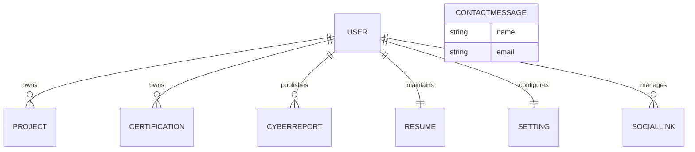

# Module 0.7 - Database Design Specification

| Document Information | Value |
|----------------------|-------|
| Module | 0.7 |
| Document ID | DSP-DDS-007 |
| Document Name | Database Design Specification |
| Project | DevStorm Portfolio Platform |
| Version | 0.1 (Draft) |
| Status | In Progress |
| Author | Kaushik Musale |
| Repository | DevStorm Portfolio Platform |
| Last Updated | July 2026 |

---

# Revision History

| Version | Date | Description | Author |
|----------|------|-------------|--------|
| 0.1 | July 2026 | Initial database design document | Kaushik Musale |

---

# Table of Contents

1. Purpose
2. Scope
3. Database Objectives
4. Database Design Principles
5. Database Selection
6. Database Architecture Overview
7. Database Standards
8. Decision Register

---

# 1. Purpose

The purpose of this document is to define the logical and physical database design for the DevStorm Portfolio Platform.

This specification establishes the structure, relationships, validation standards, indexing strategy, and data management practices that will govern the application's persistent storage.

The document serves as the authoritative reference for implementing the database layer.

---

# 2. Scope

This document covers:

- Database architecture
- Collection design
- Schema standards
- Entity identification
- Relationships
- Validation rules
- Indexing strategy
- Naming conventions
- Query optimization
- Backup strategy
- Migration strategy

Detailed Mongoose implementation will be completed during the development phase.

---

# 3. Database Objectives

The database is designed to satisfy the following objectives.

- Ensure data integrity.
- Support future scalability.
- Optimize query performance.
- Simplify maintenance.
- Minimize data duplication.
- Support secure data storage.
- Enable efficient searching.
- Support future feature expansion.
- Maintain consistent schema standards.

---

# 4. Database Design Principles

The following principles govern every collection within the system.

---

## Single Source of Truth

Each piece of information shall have one authoritative location within the database.

---

## Data Consistency

Related documents shall follow standardized naming, validation, and relationship rules.

---

## Performance First

Indexes shall be planned before implementation rather than added reactively.

---

## Validation at Multiple Layers

Validation occurs at:

- Client
- API
- Mongoose Schema
- Database Constraints

---

## Minimize Duplication

Duplicate data shall be avoided unless intentional denormalization provides measurable performance benefits.

---

## Future Scalability

Collections shall be designed to support future application growth without major restructuring.

---

# 5. Database Selection

## Selected Database

MongoDB Atlas

---

## ODM

Mongoose

---

## Selection Rationale

MongoDB was selected because it provides:

- Flexible document model
- Horizontal scalability
- High developer productivity
- Native JSON compatibility
- Excellent support within the MERN ecosystem

---

## Database Type

| Property | Value |
|----------|-------|
| Model | Document Database |
| Storage Format | BSON |
| Query Language | MongoDB Query Language (MQL) |
| ODM | Mongoose |

---

# 6. Database Architecture Overview

The application follows a layered data access model.

```text
React Frontend
        │
        ▼
REST API
        │
        ▼
Controller
        │
        ▼
Service
        │
        ▼
Repository
        │
        ▼
Mongoose
        │
        ▼
MongoDB Atlas
```

---

## Data Access Principles

- Controllers never access MongoDB directly.
- Services contain business rules only.
- Repositories manage all database operations.
- Mongoose acts as the abstraction layer.

---

# 7. Database Standards

The following standards apply to every collection.

| Standard | Description |
|-----------|-------------|
| `_id` | MongoDB ObjectId |
| `createdAt` | Automatic timestamp |
| `updatedAt` | Automatic timestamp |
| Soft Delete | Supported where appropriate |
| Validation | Required for all user inputs |
| Indexes | Defined during schema design |
| Naming | camelCase for fields |
| Collections | Plural, lowercase names |

---

## Standard Metadata Fields

Most collections will include:

```text
_id

createdAt

updatedAt
```

Collections supporting soft deletion will also include:

```text
isDeleted

deletedAt
```

---

# 8. Decision Register

| ADR ID | Decision | Status |
|---------|----------|--------|
| ADR-022 | MongoDB Atlas | Approved |
| ADR-023 | Mongoose ODM | Approved |
| ADR-024 | UUID-based Public Identifiers | Approved |
| ADR-025 | Soft Delete Strategy | Approved |
| ADR-026 | Automatic Timestamps | Approved |
| ADR-027 | Index-First Design | Approved |
| ADR-028 | Multi-Layer Validation | Approved |
| ADR-029 | Naming Standards | Approved |
| ADR-030 | Query Optimization | Approved |

---

## Part Status

| Section | Status |
|----------|--------|
| Document Information | Complete |
| Purpose | Complete |
| Scope | Complete |
| Database Objectives | Complete |
| Database Design Principles | Complete |
| Database Selection | Complete |
| Database Architecture Overview | Complete |
| Database Standards | Complete |
| Decision Register | Complete |

---

# 9. Database Architecture

## Overview

The DevStorm Portfolio Platform uses a document-oriented database architecture based on MongoDB Atlas.

Each business capability is represented as an independent collection. The design prioritizes modularity, scalability, maintainability, and efficient querying while minimizing unnecessary data duplication.

---

## Architectural Layers

```text
Application Layer
        │
        ▼
Repository Layer
        │
        ▼
Mongoose ODM
        │
        ▼
MongoDB Atlas
```

---

## Architecture Principles

- Collections represent independent business entities.
- Business logic remains outside the database layer.
- Relationships are established using ObjectId references where appropriate.
- Frequently accessed embedded data may be denormalized when justified.
- Every collection follows common schema standards.

---

# 10. Entity Identification

The following entities have been identified from the functional requirements and user stories.

| Entity | Purpose |
|---------|---------|
| User | Administrator account and authentication |
| Project | Portfolio project information |
| Skill | Technical skills |
| Certification | Professional certifications |
| CyberReport | Cybersecurity reports, labs and write-ups |
| ContactMessage | Messages submitted through contact form |
| Resume | Resume metadata and download information |
| Setting | Global application configuration |
| SocialLink | Professional social media links |

---

## Entity Classification

### Core Business Entities

These represent the primary portfolio content.

```text
User

Projects

Skills

Certifications

CyberReports
```

---

### Operational Entities

These support application operations.

```text
ContactMessages
```

Future operational entities:

```text
AuditLogs

UserSessions

Notifications
```

---

### Configuration Entities

These store application configuration.

```text
Settings

SocialLinks

Resume
```

---

# 11. Collection Overview

## Planned Collections

| Collection | Category | Primary Purpose |
|------------|----------|-----------------|
| users | Core | Administrator authentication |
| projects | Core | Portfolio projects |
| skills | Core | Technical skills |
| certifications | Core | Certifications |
| cyberReports | Core | Security reports |
| contactMessages | Operational | Visitor messages |
| resume | Configuration | Resume information |
| settings | Configuration | Site configuration |
| socialLinks | Configuration | External profile links |

---

## Collection Responsibilities

### users

Stores administrator credentials and authentication information.

---

### projects

Stores all showcased software projects including metadata, technologies, GitHub links, deployment links, screenshots and descriptions.

---

### skills

Stores categorized technical skills.

Examples:

- Frontend
- Backend
- Database
- DevOps
- Cybersecurity
- Programming Languages

---

### certifications

Stores professional certification details.

---

### cyberReports

Stores cybersecurity write-ups, reports, labs, research, and documentation.

---

### contactMessages

Stores messages submitted by visitors.

---

### resume

Stores resume metadata and downloadable file information.

---

### settings

Stores configurable application settings.

---

### socialLinks

Stores links to external professional platforms.

---

# 12. Relationship Design

MongoDB is a document database; therefore, relationships are intentionally lightweight.

The application primarily uses referenced relationships instead of deeply nested documents.

---

## Relationship Strategy

| Relationship Type | Usage |
|-------------------|------|
| Reference | Primary approach |
| Embedded Document | Small reusable objects |
| Denormalization | Limited and intentional |

---

## Relationship Diagram (ASCII)

```text
                User
                 │
      ┌──────────┼──────────┐
      │          │          │
      ▼          ▼          ▼
 Projects   Certifications  Resume
      │
      ▼
 CyberReports

Settings

SocialLinks

ContactMessages
```

---

## Relationship Diagram (Mermaid)



---

# 13. Cardinality

| Relationship | Cardinality |
|--------------|-------------|
| User → Projects | One-to-Many |
| User → Skills | One-to-Many |
| User → Certifications | One-to-Many |
| User → CyberReports | One-to-Many |
| User → Resume | One-to-One |
| User → Settings | One-to-One |
| User → SocialLinks | One-to-Many |
| Visitor → ContactMessages | One-to-Many |

---

# 14. Collection Lifecycle

Each collection follows a defined lifecycle.

```text
Create

↓

Validate

↓

Store

↓

Read

↓

Update

↓

Archive (Soft Delete)

↓

Permanent Deletion (Administrative)
```

---

## Lifecycle Principles

- Validation occurs before persistence.
- Updates modify the `updatedAt` field automatically.
- Soft deletion is preferred where applicable.
- Permanent deletion is restricted to administrative operations.

---

# 15. Collection Ownership

| Collection | Owner |
|------------|-------|
| users | Authentication Module |
| projects | Portfolio Module |
| skills | Skills Module |
| certifications | Certification Module |
| cyberReports | Cybersecurity Module |
| contactMessages | Contact Module |
| resume | Resume Module |
| settings | Configuration Module |
| socialLinks | Configuration Module |

---

## Database Overview Summary

| Category | Count |
|----------|------:|
| Core Collections | 5 |
| Operational Collections | 1 |
| Configuration Collections | 3 |
| Total Collections | 9 |

---

## Part Status

| Section | Status |
|----------|--------|
| Database Architecture | Complete |
| Entity Identification | Complete |
| Collection Overview | Complete |
| Relationship Design | Complete |
| Cardinality | Complete |
| Collection Lifecycle | Complete |
| Collection Ownership | Complete |

---

# 16. Collection Specifications

This section defines the logical schema for each collection.

Each specification includes:

- Purpose
- Fields
- Data Types
- Validation
- Constraints
- Relationships
- Indexes

---

# 16.1 Users Collection

## Purpose

Stores administrator authentication and profile information.

---

### Collection Name

```text
users
```

---

### Fields

| Field | Type | Required | Description |
|---------|------|----------|-------------|
| _id | ObjectId | Yes | Primary identifier |
| publicId | UUID | Yes | Public identifier |
| fullName | String | Yes | Administrator name |
| email | String | Yes | Login email |
| password | String | Yes | Hashed password |
| role | String | Yes | Administrator role |
| isActive | Boolean | Yes | Account status |
| lastLogin | Date | No | Last login timestamp |
| createdAt | Date | Yes | Creation timestamp |
| updatedAt | Date | Yes | Last update timestamp |

---

### Validation Rules

- Email must be unique.
- Password must be hashed using bcrypt.
- Role defaults to Administrator.
- Email stored in lowercase.

---

### Indexes

- email (Unique)
- publicId (Unique)

---

### Relationships

One User

↓

Many Projects

↓

Many Certifications

↓

Many Cyber Reports

---

# 16.2 Projects Collection

## Purpose

Stores portfolio project information.

---

### Collection Name

```text
projects
```

---

### Fields

| Field | Type | Required |
|---------|------|----------|
| _id | ObjectId | Yes |
| publicId | UUID | Yes |
| title | String | Yes |
| slug | String | Yes |
| shortDescription | String | Yes |
| fullDescription | String | Yes |
| technologies | Array | Yes |
| category | String | Yes |
| githubUrl | String | No |
| liveUrl | String | No |
| thumbnail | String | Yes |
| images | Array | No |
| featured | Boolean | Yes |
| status | String | Yes |
| createdBy | ObjectId | Yes |
| createdAt | Date | Yes |
| updatedAt | Date | Yes |

---

### Validation Rules

- Title required.
- Slug unique.
- Featured defaults to false.
- Technologies cannot be empty.

---

### Indexes

- slug (Unique)
- featured
- category
- status

---

### Relationships

Many Projects

↓

One User

---

# 16.3 Skills Collection

## Purpose

Stores technical skills displayed in the portfolio.

---

### Collection Name

```text
skills
```

---

### Fields

| Field | Type | Required |
|---------|------|----------|
| _id | ObjectId | Yes |
| publicId | UUID | Yes |
| name | String | Yes |
| category | String | Yes |
| proficiency | Number | Yes |
| icon | String | No |
| displayOrder | Number | Yes |
| createdAt | Date | Yes |
| updatedAt | Date | Yes |

---

### Validation Rules

- Skill name required.
- Proficiency between 0–100.
- Display order defaults to ascending.

---

### Indexes

- category
- displayOrder

---

# 16.4 Certifications Collection

## Purpose

Stores professional certifications.

---

### Collection Name

```text
certifications
```

---

### Fields

| Field | Type | Required |
|---------|------|----------|
| _id | ObjectId | Yes |
| publicId | UUID | Yes |
| title | String | Yes |
| issuer | String | Yes |
| issueDate | Date | Yes |
| expiryDate | Date | No |
| credentialId | String | No |
| verificationUrl | String | No |
| certificateImage | String | No |
| createdBy | ObjectId | Yes |
| createdAt | Date | Yes |
| updatedAt | Date | Yes |

---

### Indexes

- issuer
- issueDate

---

### Relationships

Many Certifications

↓

One User

---

# 16.5 Cyber Reports Collection

## Purpose

Stores cybersecurity write-ups, reports and lab documentation.

---

### Collection Name

```text
cyberReports
```

---

### Fields

| Field | Type | Required |
|---------|------|----------|
| _id | ObjectId | Yes |
| publicId | UUID | Yes |
| title | String | Yes |
| slug | String | Yes |
| category | String | Yes |
| difficulty | String | No |
| summary | String | Yes |
| content | String | Yes |
| toolsUsed | Array | No |
| tags | Array | No |
| coverImage | String | No |
| published | Boolean | Yes |
| createdBy | ObjectId | Yes |
| createdAt | Date | Yes |
| updatedAt | Date | Yes |

---

### Validation Rules

- Slug unique.
- Published defaults to false.
- Title required.

---

### Indexes

- slug
- category
- published
- tags

---

### Relationships

Many Reports

↓

One User

---

# 17. Common Schema Standards

The following standards apply across all collections.

| Property | Standard |
|-----------|----------|
| Primary Key | ObjectId |
| Public Identifier | UUID |
| Timestamps | Automatic |
| Validation | Mongoose + API |
| Soft Delete | Where applicable |
| Naming Convention | camelCase fields |
| Collections | Lowercase plural |

---

# 18. Shared Metadata Fields

Most collections include the following metadata.

| Field | Type |
|---------|------|
| _id | ObjectId |
| publicId | UUID |
| createdAt | Date |
| updatedAt | Date |

Optional administrative fields:

| Field | Type |
|---------|------|
| isDeleted | Boolean |
| deletedAt | Date |

---

## Part Status

| Section | Status |
|----------|--------|
| Users Collection | Complete |
| Projects Collection | Complete |
| Skills Collection | Complete |
| Certifications Collection | Complete |
| Cyber Reports Collection | Complete |
| Common Schema Standards | Complete |
| Shared Metadata | Complete |

---

